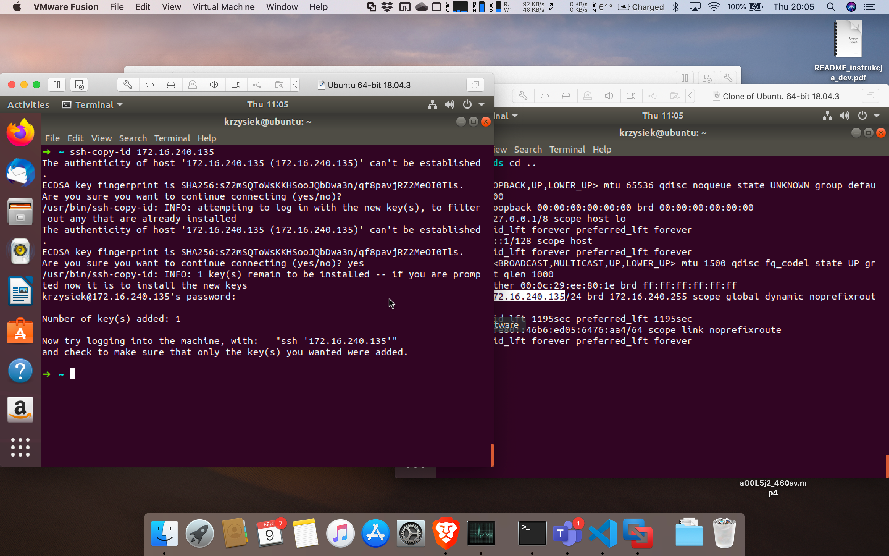
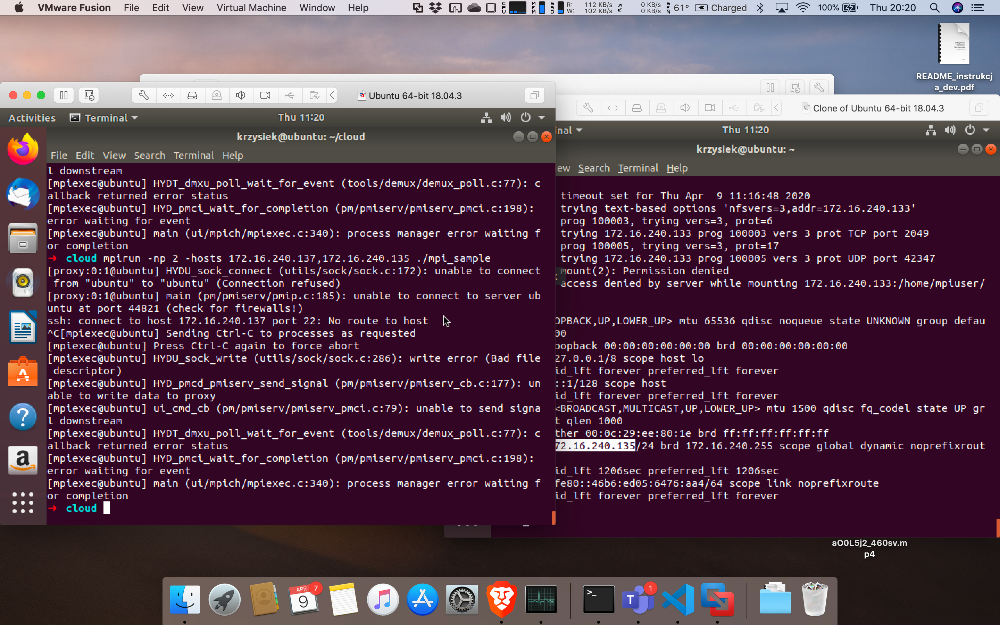

# Całkowanie z zastosowaniem standardu MPI

Równoległe obliczanie całki oznaczonej z zastosowaniem metod numerycznych.

<!-- Link do repozytorium: https://github.com/SiwyKrzysiek/mpi-integration -->

## Spis treści

- [Całkowanie z zastosowaniem standardu MPI](#całkowanie-z-zastosowaniem-standardu-mpi)
  - [Spis treści](#spis-treści)
  - [Treść zadania](#treść-zadania)
    - [Zadania do wykonania w ramach ćwiczenia](#zadania-do-wykonania-w-ramach-ćwiczenia)
  - [Realizacja zadania](#realizacja-zadania)
    - [Uruchomienie programu](#uruchomienie-programu)
  - [Zadania dodatkowe](#zadania-dodatkowe)
    - [Napisanie programu z wykorzystaniem komunikacji grupowej](#napisanie-programu-z-wykorzystaniem-komunikacji-grupowej)
    - [Napisanie programu z wykorzystaniem komunikacji nieblokującej](#napisanie-programu-z-wykorzystaniem-komunikacji-nieblokującej)
    - [Uruchomienie programu na kilku maszynach](#uruchomienie-programu-na-kilku-maszynach)
  - [Nowe zadania](#nowe-zadania)
    - [Całkowanie z wykorzystaniem komunikacji grupowej](#całkowanie-z-wykorzystaniem-komunikacji-grupowej)
    - [Całkowanie z wykorzystaniem komunikacji nieblokującej](#całkowanie-z-wykorzystaniem-komunikacji-nieblokującej)

## Treść zadania

Proszę policzyć przy pomocy metody prostokątów/trapezów/Simpsona (możecie Państwo wybrać metodę) całkę oznaczoną funkcji jednej zmiennej. Procedura całkowania powinna przyjmować: wskaźnik na całkowaną funkcję, początek i koniec przedziału całkowania oraz liczbę punktów dla których obliczana jest wartość funkcji. Oto jej nagłówek:

```c
double integrate(double (*func)(double), double begin, double end, int num_points);
```

Całkowanie powinno być wykonane równolegle przy użyciu standardu MPI. Wybrany proces główny rozdziela przedział całkowania oraz liczbę punktów, w których będą wykonywane obliczenia pomiędzy siebie i pozostałe procesy. Rozsyła potrzebne informacje do pozostałych procesów oraz wykonuje swoją część obliczeń. Następnie zbiera wyniki od pozostałych procesów i sumuje je ze swoim wynikiem cząstkowym. Ostatecznie wypisuje wynik całkowity na standardowe wyjście. Proszę zwrócić uwagę na to, że każdy z procesów powinien liczyć całkę dla pewnej liczby punktów, która została mu przydzielona przez proces główny (suma punktów z wszystkich procesów powinna być równa liczbie podanej jako argument wejściowy) – zatem proces główny powinien dokonać rozsądnego podziału danych wejściowych pomiędzy procesy.

Program powinien pozwalać na ustawienie początku i końca przedziału całkowania oraz całkowitej liczby punktów. Program powinien działać poprawnie dla dowolnej, zadanej przez prowadzącego, liczby procesów oraz liczby punktów. Komunikacja pomiędzy procesami powinna zostać zrealizowana jedynie przy użyciu funkcji (`MPI_Send`, `MPI_Recv`).

Interfejs programu powinien wyglądać następująco:

`./integrate begin end num_points`

### Zadania do wykonania w ramach ćwiczenia

1. Napisanie procedury całkowania
2. Podział liczby punktów na poszczególne procesy (możliwie równy!)
3. Podział przedziałów całkowania dla poszczególnych procesów
4. Rozesłanie do procesów „robotników” danych umożliwiających obliczenia cząstkowe.
5. Odbiór danych przez procesy.
6. Wykonanie obliczeń w procesie głównym.
7. Wykonanie obliczeń w procesach „robotnikach”
8. Przesłanie obliczeń cząstkowych do procesu głównego.
9. Zsumowanie wszystkich wyników i wyświetlenie wyniku końcowego.

## Realizacja zadania

> Podczas pracy z _Open MPI_ zainstalowanym przy pomocy brew po zakończeniu programu pojawiał się błąd. Pomogło ustawienie zmiennej środowiskowej `PMIX_MCA_gds=hash`

Głowna cześć zadania jest realizowane przez funkcję `double integrate(double (*func)(double), double begin, double end, int num_points)`.

Jej wykonanie przebiega różnie w zależności od tego czy aktualny proces jest procesem głównym.
Proces główny przygotowuje punkty, w których będzie liczona wartość funkcji oraz możliwie równy podział wygenerowanych punktów między siebie i pozostałe procesy.
Do podziału został wykorzystany algorytm, który napisałem na potrzeby wcześniejszych zadań.  
Po przygotowaniu podziału proces główny przesyła do wszystkich pozostałych punkty, na których mają one dokonać obliczeń. Jest to wykonane za pomocą 2 instrukcji `MPI_Send()`, gdzie pierwsza przesyła ilość danych a druga dane.

W między czasie procesy nie będące procesem głównym oczekują na dane przy pomocy funkcji `MPI_Recv()`.

Po otrzymaniu danych, każdy proces wykonuje na nich funkcję `integrateRange()`, która liczy wartość całki korzystając z podanych punktów jako węzłów. Po zakończeniu obliczeń procesy przesyłają swoje wyniki do procesu głównego, gdzie są one sumowane do wartości całkowitej.

### Uruchomienie programu

Ponieważ program korzysta ze standardu _MPI_ wymaga odpowiedniego kompilatora oraz programu uruchamiającego. Pozwala to na łatwe utworzenie i zarządzanie pulą procesów.

Przed uruchomieniem programu trzeba zainstalować `mpicc` oraz `mpirun`. W przypadku sytemu OS X można to zrobić poleceniem `brew install open-mpi`.

Będąc **w katalogu ./integrate** program można łatwo zbudować przy pomocy narzędzia _make_.

```bash
make
```

W celu dodanie wyświetlenia szczegółowych informacji o działaniu programu można skorzystać z celu `make debug`.

Uruchomienie programu do uruchomienia programu trzeba wykorzystać `mpiexec`.

Przykładowe uruchomienie:

```txt
➜ mpiexec -n 4 ./integrate 0 2 10000
Program will integrate function y = x^2
Result: 2.665967
```

Program jest uruchomiony z 4 procesami, liczy całkę dla przedziału od 0 do 2 z wykorzystaniem 10000 węzłów.

## Zadania dodatkowe

Realizacja dodatkowych zadań z iSoda.
Przy pierwszym podejściu do tego zadania zrozumiałem, że należy napisać dowolne programy dobrze obrazujące wykorzystanie podanych rodzajów komunikacji.
Wersje programu całkującego z wykorzystaniem różnych metod komunikacji znajdują się w sekcji [Nowe zadania](#Nowe-zadania).

### Napisanie programu z wykorzystaniem komunikacji grupowej

W celu przetestowania komunikacji grupowej napisany został program obliczający średnią wartoś liczby zwracanej przez generator pseudolosowy.

Kod programu znajduje się w katalogu [additional_tasks/group_communication](./additional_tasks/group_communication).

Program wykorzystuje funkcję `MPI_Scatter()` do rozesłania części tablicy między podppoorgramy.
Następnie każdy podprogram, razem z głównym, obliczają średnią cząstkową swojej części danych.

Wyniki cząstkowe są sumowane i zwracane do procesu głównego przy pomocy funkcji `MPI_Reduce()`.

Program kompiluje się i uruchamia analogicznie jak program główny, ale nie przyjmuje on argumentów.

### Napisanie programu z wykorzystaniem komunikacji nieblokującej

W celu poznania komunikacji nieblokującej napisany został prosty program symulujący restaurację dostarczającą pizze.
Program znajduje się w katalogu [additional_tasks/non_blocking_communication](./additional_tasks/non_blocking_communication).

Za równo klient jak i pizzeria mają swoje zajęcia, które realizuję w oczekiwaniu na komunikację.
Pizzeria jeśli nie ma zamówienia do realizacji zajmuje się klientami w lokali i tylko okresowo sprawdza czy są jakieś zamówienia.  
Klient w oczekiwaniu na zamówienie oddaje się pracy. Tylko raz na jakiś czas wychodzi na ganek swojego domu i sprawdza czy nie pojawiła się tam pizza 🍕.

Program kompiluje się i uruchamia analogicznie jak program główny, ale nie przyjmuje on argumentów.

### Uruchomienie programu na kilku maszynach

Przy próbie realizacji zadania wzorowałem się artykułem [Running an MPI Cluster within a LAN](https://mpitutorial.com/tutorials/running-an-mpi-cluster-within-a-lan/).

Do uruchomienia programu mpi na kilku maszynach ciałem wykorzystać dwie maszyny wirtualne Ubuntu.

Na początek zadbałem o komunikację między maszynami. W tym celu podłączyłem je interfejsem mostkowym do sieci gospodarza.
Umożliwiłem również komunikację shh bez podawania hasła przy pomocy kluczy rsa.



Następnie skonfigurowałem udostępnianie katalogu cloud przy pomocy nfs.

Niestety przy próbie uruchomienia programu na 2 maszynach wystąpił błąd, którego nie byłem w stanie rozwiązać.



Niestety nie udało mi się wykonać tego zadania, zyskałem jednak wiedzę, jak przebiega proces wykonywania programu na wielu maszynach w standardzie MPI.

## Nowe zadania

Ponowna implementacja algorytmu całkującego z wykorzystaniem różnych metod komunikacji.  
Sekcja dodana po sprecyzowaniu wymagań 07.04.2020.

### Całkowanie z wykorzystaniem komunikacji grupowej

Oryginalny program został zmodyfikowany tak, by korzystał z funkcji `MPI_Scatter()` oraz `MPI_Reduce()`.
Bardzo dobrze pasują one do realizowanego problemu, co pozwoliło znacznie skrócić i uprościć oryginalny kod.

Program znajduje się w katalogu [more_integration/group_communication](./more_integration/group_communication). Zmianom uległa funkcja `integrate()`, której implementacja zaczyna się w **linii 115**.

Uruchomienie programu jest takie same jak programu głównego i jest opisane w sekcji [Uruchomienie programu](#Uruchomienie-programu), z tym wyjątkiem, że z uwagi na zastosowanie `MPI_Scatter()` liczba punktów całkowania musi być podzielna przez liczbę procesów.

### Całkowanie z wykorzystaniem komunikacji nieblokującej

Oryginalny program został zmodyfikowany tak, by korzystał z funkcji `MPI_Isend()` oraz `MPI_Irecv()` zamiast ich blokujących odpowiedników.
Uważam, że zadany problem nie wymaga komunikacji nieblokującej i jej zastosowanie było zbędne.
Mimo tego spróbowałem wykorzystać zalety płynące z tej formy komunikacji.

Program znajduje się w katalogu [more_integration/non_blocking_communication](./more_integration/non_blocking_communication). Zmianom uległa funkcja `integrate()`, której implementacja zaczyna się w **linii 105**.

Zastosowanie komunikacji nieblokującej umożliwiło to, że główny proces nie musi czekać z rozpoczęciem obliczeń na odebranie danych przez inne procesy.

Bardzo ciekawie wyszło też odbieranie wyników cząstkowych od procesów.  
Dzięki zastosowaniu funkcji `MPI_Waitany()` proces główny może od razu dodać do sumy całkowitej wynik cząstkowy procesu, który akurat skończył pracę. Pozwala to na zmniejszenie opóźnienia wynikającego z czekania zawsze na proces o najmniejszej randze.

Dla procesów wykonujących jedynie obliczenia lepiej sprawdza się komunikacja blokująca, ponieważ nie maja one innych zadań, które mogłyby realizować w czasie oczekiwania na komunikację.

Uruchomienie programu jest takie same jak programu głównego i jest opisane w sekcji [Uruchomienie programu](#Uruchomienie-programu).
